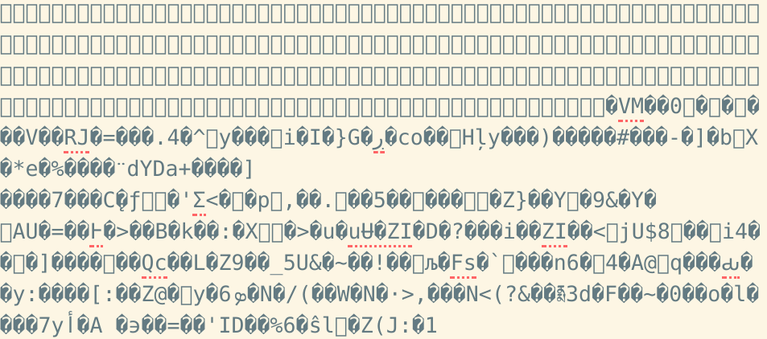
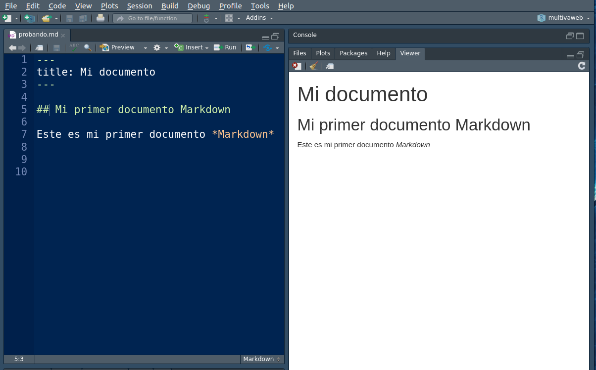
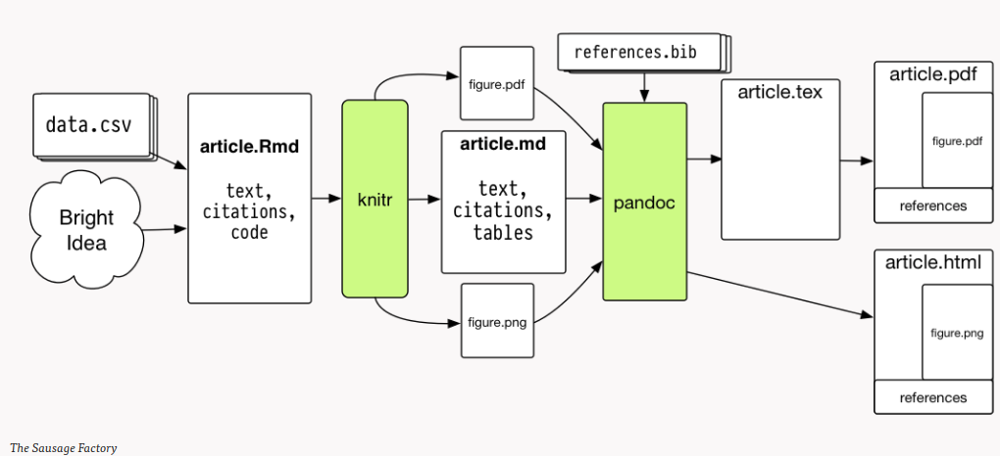

# Lenguaje reproducible

Este capítulo comienza problematizando el uso de procesadores de texto tradicionales para la escritura académica, y desde aquí se propone la escritura en texto simple como una alternativa. Como todo aprendizaje de algo nuevo tiene un costo inicial: implica salir de la costumbre de usar nuestro procesador habitual (probablemente Word) para escribir todo. Pero los beneficios son grandes, no solo en términos de apertura y reproducibilidad, sino también a la larga de eficiencia y de posibilidades de colaboración.

La imagen de inspiración para esto es la siguiente:

```{r echo=FALSE, karatekid, fig.cap='Karatekid', fig.align='center'}

```
Es algo muy ochentero, así que lo cuento: es de la película "Karatekid", donde un adolescente conoce a un maestro que le enseña Karate comenzando con un entrenamiento poco tradicional, como pintar la reja de su casa y lavar autos. Esta fase inicial sin sentido le permite al protagonista adquirir movimientos que luego puede usar para el karate. Un clásico. Y en este capítulo inicial es parecido: vamos a comenzar con aspectos básicos que tal vez tengan poco sentido en sí mismo, hasta poder ver como se utiliza en capítulos posteriores. Es la fase más dura, pero luego tiene sus recompensas.


## Escritura académica y procesadores de textos.

La escritura en computador usualmente tiene como referencia un solo nombre: _Word_. Abrimos Word, elegimos letra y espaciado, justificamos, hacemos tablas. Y estamos todos acostumbrados, este programa y modelo de escritura se ha transformado en un estándar, y un monopolio. Razones para su éxito hay suficientes: transforma el computador en una moderna máquina de escribir, vemos inmediatamente en la pantalla la emulación de una hoja de papel que finalmente tendremos en nuestras manos luego de estar impresa. ¿Qué desventajas podría tener este modelo de trabajo? En términos de ciencia abierta, la principal desventaja tiene que ver con la propiedad y reproducibilidad de los contenidos que hay en el documento. Esto se ilustra en la siguiente imagen:

```{r echo=FALSE, word, fig.cap='Código detrás de Word', fig.align='center'}

```
Si se abre un archivo de Word con un editor común y corriente (por ejemplo, el block de notas de Windows) lo que se ve es algo parecido a lo que aparece en la Figura \@ref(fig:word). Lo que aparece es el código que el programa Word puede transformar en el documento que se ve en pantalla al abrirlo en Word. Este código, libre de formato, es la información que verdaderamente nos pertenece independientemente de Word. El problema es que en primer lugar Word es un software comercial, es decir, se paga una licencia para poder acceder a los contenidos que uno mismo escribe. Tal vez no se suela pagar esta licencia directamente, pero si se paga al comprar un computador con el programa pre-instalado, o al usarlo en la Universidad que sí paga licencias. Imaginemos que por alguna razón la licencia se haga más restrictiva, o suba de precio, o que el programa deje de funcionar. Todos los contenidos guardados en archivos .doc o .docx podrían ser inaccesibles. Entonces, ¿a quién pertenencen realmente los contenidos de estos documentos?

Ahora bien, sabemos que hay alternativas gratuitas a Word, como LibreOffice, que solucionan el tema del pago. Aún así, no se soluciona el acceso a los contenidos independiente del programa específico utilizado. Por lo tanto, el espacio de escritura más libre y abierto es aquel donde el contenido nos pertenezca, independiente de una interfaz (comercial o no). Y esto implica escritura libre de programas, también llamada escritura simple o plana, tal como se escribe directamente en el terminal de un computador o en un editor simple de texto como el block de notas.

Es un precio alto a pagar por la escritura abierta. Y para hacer ciencia abierta, no es estrictamente necesario escribir en un formato abierto, pero es mucho más coherente con el sentido de la apertura y por eso resulta relevante señalarlo como una opción posible. Además, la escritura en texto simple se enfoca principalmente en los contenidos, disminuyendo el énfasis constante en formato que siempre está presente en los programas _WYSIWYG_ y que interrumpe el proceso de escritura. Y finalmente, la escritura en texto simple hace posible un apropiado control de versiones, tema que revisaremos más adelante.

Entonces, ante este dilema el objetivo es poder escribir en formato simple, pero a la vez mantener las opciones de formato en un documento final que sea presentable. Para esto existen los lenguajes de escritura simple, a los cuales se pueden agregar elementos de formato o _marcas_, que le indican a un programa externo de formato cómo traducir esas marcas en un documento publicable. Estas marcas pueden indicar qué es un título, palabras con énfasis (como negrita o cursiva), llamado de imágenes y tablas, índices, etc.

El lenguaje tradicional de escritura simple con marcas es [LaTeX](https://www.latex-project.org/), especializado en la generación de documentos formateados para publicación científica. LaTeX permite obtener un gran control del formato final mediante sofisticadas opciones de marcas de texto, sin embargo, aprender a escribir en este lenguaje posee una curva de aprendizaje bastante empinada.

La alternativa más reciente a LaTeX es [_Markdown_](https://www.markdownguide.org/). Markdown significa "pocas marcas", haciendo contraste a lenguajes como LaTeX que poseen muchas marcas de formato. Así, Markdown puede definirse como un lenguaje minimalista de escritura en texto simple, con marcas de formato muy escuetas y de fácil aprendizaje. Además, presenta mucha flexibilidad en sus opciones de salida de documento, pudiendo transformarse fácilmente en HTML, LaTeK, pdf, e incluso Word.


## Markdown

Markdown no es un programa de edición de texto, es simplemente un lenguaje, una forma de escribir que puede ser utilizada en distintos editores de texto. Con esta forma de escribir, luego otro programa identifica las marcas de texto y las transforma en un documento con formato. Este programa que convierte documentos Markdown en otros documentos es [_pandoc_](https://pandoc.org/), un convertidor entre distintos formatos. Pandoc es el programa que hará todo el trabajo en las sombras, no lo veremos ni tampoco es estrictamente necesario conocer su funcionamiento directo, pero en realidad este es el programa que permite escritura simple sin renunciar a documentos con un formato de calidad presentable. Por ejemplo, un título en Markdown se señala con la marca `#`, por ejemplo, `# Introducción`, y Pandoc identifica esta marca y convierte esta línea en título en el documento de salida que se le solicite. Por cierto, Pandoc es gratuito y de código abierto.

Para poder utilizarlo sirve cualquier editor de texto, incluso algo como el block de notas. Sin embargo, para facilitar la escritura se utilizan editores que tengan soporte especializado para Markdown, para poder reconocer de mejor manera las marcas en el mismo editor. Existen muchos editores disponibles, siendo los más populares [Emacs](https://www.gnu.org/software/emacs/), [Sublime](https://www.sublimetext.com/), [Atom](https://atom.io/), [VSC](https://code.visualstudio.com/). También RStudio puede calificarse como un editor, aún cuando está especializado en un programa específico (R). Lo utilizaremos principalmente por las opciones que tiene para una variedad específica de Markdown denominada RMarkdown (ver sección siguiente), y que permite combinar texto y análisis en un mismo documento, favoreciendo la reproducibilidad.

### Marcas de edición en Markdown

**Títulos**

Los títulos se generan mediante el carácter # , de la siguiente manera:

```
# Titulo 1
## Título 2
### Título 3
```

Lo que al convertirse  (por ejemplo, a HTML) genera lo siguiente:

<b><font size=6>Titulo 1</font></b>

<b><font size=5>Titulo 2</font></b>

<b><font size=4>Titulo 3</font></b>


**Negritas / cursivas**

```
esto es **negrita**
esto es *cursiva*
```
esto es **negrita**
esto es _cursiva_

---

**Listas**

        ```
        - item 1
        - item 2
          - item sub 2
            - item sub 2 sub 2

        1. item
        2. item
            - item
            - item
        ```

- item 1
- item 2
  - item sub 2
    - item sub 2 sub 2

1. item
2. item
    - item
    - item

---

**Web links**

[Facso](http://www.facso.uchile.cl/)
[http://www.facso.uchile.cl/](http://www.facso.uchile.cl/)

```
[Facso](http://www.facso.uchile.cl/)
[http://www.facso.uchile.cl/](http://www.facso.uchile.cl/)
```

---

**Imágenes**

En general:
```

```

Ejemplo:
```

```


Esta imagen se encuentra en el subdirectorio images.

Si se desea agregar otros elementos de edición como centrado o tamaño, hay que recurrir a otro tipo de marcas, como html:

```
<p align="center">
  
</p>
```
<p align="center">
  
</p>

Como se puede ver, markdown está hecho para edición simple, y cualquier aspecto que requiera una mayor edición implica recurrir a otros lenguajes, en este caso html.

---
**Tablas**

Markdown no es un lenguaje óptimo para generar tablas. Justamente se trata de que las tablas sean generadas automáticamente por los programas de análisis de datos. Sin embargo en ocasiones es necesario realizar tablas con contenidos de texto, por ejemplo

```
Esta        |es        | la tabla
 -          |-         |-
y           | este     | el
contenido   | de las   | celdas
```


Esta        |es        | la tabla
 -          |-         |-
y           | este     | el
contenido   | de las   | celdas

### Opciones adicionales de formato en Markdown

Las marcas de formato en Markdown son muy limitadas, es parte de su sentido original. Sin embargo, si se quiere agregar otras opciones de formato (titulo del documento, márgenes, interlineado, formato de las tablas,  etc.) esto se hace por separado en la sección inicial o preámbulo del documento, que en el caso de Markdown se llama "encabezado YAML" (Yet Another Markdown Language). Esta sección se identifica porque aparece al principio del documento con tres guiones al comienzo y al final. Revisaremos esto con mayor detalle más adelante en la sección de documentos dinámicos:

### Sobre los archivos Markdown

Los archivos Markdown por lo general tienen extension .md. Ahora, estos archivos pueden ser abiertos con cualquier editor simple disponible en el computador, no se asocian a un programa específico. Para poder luego generar (render) un documento formateado a partir del Markdown, los editores de texto tienen rutinas asociadas que lo facilitan, muchas veces solo con un click.

### Usando RStudio como editor de Markdown

RStudio se ha especializado progresivamente en una versión de Markdown, que es RMarkdown, pero antes de profundizar en esta versión veremos algunos ejemplos en Markdown tradicional. Algunas características del trabajo con Markdown:

- Para crear un archivo Markdown en RStudio simplemente crear archivo de código (File -> New File -> R Script, o simplemente Ctrl + Shift + N); luego al momento de guardar dar extensión .md (ejemplo: prueba.md)

- Con esto se puede comenzar a escribir en la hoja de código y probar las marcas de Markdown de la sección anterior.

- Para poder visualizar de mejor manera las marcas de edición en el editor algunas opciones de visualización en RStudio (editor themes) son mejor que otras; en general las más recomendables son las de los temas "Tomorrow", pero depende del gusto personal. Esto se puede ajustar en Tools -> Global Options -> Appearance -> Editor Theme.

```{r echo=FALSE, markdownR, fig.cap='Ejemplo documento Markdown en RStudio', fig.align='center'}

```
En la \@ref(fig:markdownR) se muestra una sesión de RStudio, con el documento Markdown a la izquierda, y su conversión a HTML a la derecha. Para poder generar el HTML (o pdf) en RStudio se utiliza la librería Knitr, que se detalla en la sección siguiente.


## Documentos dinámicos con RMarkdown

En la investigación académica en general el proceso de escritura se encuentra separado del análisis, en programas y documentos distintos. El traspaso de información entre el programa de análisis y el programa de edición de texto se realiza con un clásico: cortar y pegar.

_¿Cuáles son las desventajas de cortar y pegar?_

- La principal es el límite a la reproducibilidad. ¿Cómo identificar los análisis que finalmente son reportados?

- Eficiencia: cada vez que se realicen cambios en los análisis, nuevamente implica cortar-pegar, y es difícil llevar un registro apropiado de las versiones de los documentos.

Los **documentos dinámicos** permiten lidiar con las limitaciones anteriores, ya que los análisis y resultados están en un mismo documento. Esto es posible ya que se combinan dos lenguajes en texto plano: escritura y código de análisis. La clave es que el programa de edición y de análisis pueda identificar qué secciones del texto corresponden a escritura y cuáles corresponden a análisis.

_¿Por qué escribir en texto plano en lugar de un programa que me muestre inmediatamente el texto y su formato (tipo Word)?_
Hay múltiples razones, solo resalto dos:

1 - **Propiedad**: los contenidos guardados en formatos de procesadores comerciales (como Word) dependen del pago de una licencia para poder leerse. Si el software es imposible leerlos, por lo tanto la propiedad de los contenidos guardados en ese formato no son del autor/a, sino de la empresa de software. El texto plano no depende de un software comercial para poder leerse ni modificarse.

2 - **Flexibilidad en incorporación de texto y análisis**: el escribir en texto plano permite incluir en un mismo documento elementos de escritura y de análisis de datos realizado en texto plano, por lo tanto no se requiere cortar ni pegar en otro documento.

Actualmente existen una serie de herramientas que facilitan la elaboración de documentos dinámicos, en particular basados en la librería `knitr` (tejer). Esta librería permite generar documentos escritos en lenguaje Markdown y análisis realizado en R.


## Rmarkdown / Knitr

Excelente referencia: [RMardown for scientists](https://rmd4sci.njtierney.com/)

Rmarkdown es una versión de Markdown pero con algunas características especiales. La principal de ellas es que, además de la escritura en Markdown, permite incorporar código y resultados de R en un mismo documento, a través de la librería `knitr` (en español tejer).

Knitr es una librería de R que convierte (compila) documentos escritos en Rmarkdown y que combinan texto y análisis hacia otros formatos. Esto es posible ya que reconoce marcas de edición y código de análisis y permite su transformación a formatos como pdf, word y html. Una representación del flujo según Healey es la siguiente:



El documento central de trabajo es uno en formato .Rmd (Rmarkdown), que combina texto en Markdown y código R, lo que se detalla más abajo. La librería `Knitr` hace la transformación de este documento a formatos como html y/o pdf, para lo cual utiliza el convertidor pandoc.

No es necesario conocer al detalle todos los elementos de este flujo para hacer funcionar un documento dinámico, sino básicamente dos: 1) Markdown, y 2) Trozos de código. Vamos por parte.

### Trozos (chunks) de código

La caracteristica principal de `Knitr` es que identifica las secciones de código en la hoja y los ejecuta mediante R. Estos trozos de código se encuentran delimitados de la siguiente manera:
````
```{r}`r ''`
    4+5
```
````

Es decir, todo lo que comience por ` ```r` y termine con ` ``` ` será identificado como código de análisis (el atajo para generar un chunk en RStudio es `ctrl+alt+i`)

### Tipos de chunks

En general hay cinco opciones básicas de edición relacionadas con chunks y su visualización en el documento final. Esto se maneja mediante opciones que aparecen al inicio en el chunk, luego de la letra `r`

1. código y resultado (opción por defecto)

````
```{r}`r ''`
1 + 1
```
````

Resulta
```{r}
1 + 1
```

2. solo código, ocultando resultados:

````
```{r, results='hide'}`r ''`
1 + 1
```
````

Resulta:

```{r results='hide'}
1 + 1
```


3. solo resultado
````
```{r, echo=FALSE}`r ''`
1 + 1
```
````

Resulta:
```{r, echo=FALSE}
1 + 1
```


4. ni código ni resultado `{r echo=FALSE results='hide'}`
5. resultado "tal cual como es": `{r results='asis'}` se utiliza principalmente para comandos de generación de tablas, que arrojan un código que luego puede ser interpretado por otro lenguaje (por ejemplo, html)

### Trabajando con documentos dinámicos en RStudio

RStudio es principalmente un editor para análisis de datos con R, pero últimamente ha ido incorporando herramientas para reportes dinámicos. Para ello utiliza un tipo de archivos con extensión `Rmd` que significa Rmarkdown. Y en este contexto Rmarkdown es la forma en que Rstudio identifica los archivos que combinan texto y código.

Para generar un archivo Rmarkdown, simplemente new file > Rmarkdown


Y luego para convertir este documento, presionar el boton `Knitr`.

El generador de documentos por defecto trae un texto de ejemplo donde hay analisis y tablas, y además dos cosas:

- **Preámbulo o YAML (Yet Another Markdown Language)**: esta sección del inicio que se encuentra enmarcada entre `---` incluye algunos datos básicos del documento que luego se consideran al momento de convertirlo al documento editado final. Por ejemplo, si se prefiere que la conversión sea a html,  se incluye la opción `output: html_document`

      ---
      title: "nuevo"
      author: "jc"
      date: "5/30/2019"
      output: html_document
      ---

- **Chunk de opciones generales**: va al inicio del documento, luego del YAML. En general, la que aparece por defecto `echo=TRUE` se refiere a que se muestren los resultados de los chunks de código.

## Citando plano


*Objetivo*: facilitar la inclusión de citas y referencias bibliográficas en documentos escritos en texto plano (Markdown / Latex).

<br/>

#### Bibtex, Zotero y Better BibTex (BBT)

La forma general como funciona la inclusión de referencias en texto plano (Latex/Markdown) es tenerlas almacenadas en formato Bibtex (archivos en extensión _.bib_). Este formato almacena las referencias en base a ciertos campos donde se incluye la información correspondiente. Por ejemplo:

```
@article{sabbagh_dimension_2003,
  title = {The Dimension of Social Solidarity in Distributive Justice},
  volume = {42},
  timestamp = {2014-09-26T12:30:41Z},
  number = {2},
  urldate = {2014-09-26},
  journal = {Social science information},
  author = {Sabbagh, Clara},
  year = {2003},
  pages = {255--276},
  file = {Snapshot:/storage/V5R7I29W/255.html:text/html},
  groups = {social justice theory,social justice theory}
}
```

Luego, en la primera línea aparece la "clave" (key) de la referencia (en este caso sabbagh_dimension_2003), que permite llamarla en el texto como veremos más adelante.

Por supuesto, almacenar manualmente referencias en este formato bib no es muy amigable. Si bien una serie de softwares de administración de referencias tienen la opción de convertir fácilmente la colección o parte de ella a formato .bib, el problema es que si se añade una referencia en el software, cada vez habría que convertir/sincronizar nuevamente a .bib para mantener esta base también actualizada. Por lo tanto, lo ideal sería que una colección .bib se actualizara automáticamente desde un software de gestión de referencias. La solución que por ahora se recomienda es usar la aplicación Better(bib)tex (BBT), que funciona dentro de Zotero (www.zotero.org). Ambos gratuitos y de código abierto, así que ok. BBT genera una colección .bib en base a librerías Zotero, se configura solo una vez y luego se mantiene sincronizada, para no preocuparse más del asunto.

**Zotero / BBT**: El funcionamiento de Zotero queda fuera del alcance de este tutorial, solo nos enfocaremos en el vínculo con BBT.

  - Bajar Zotero 5 standalone <https://www.zotero.org/>
  - Bajar el archivo para instalar BBT, ultima actualización al 19 oct 2017: <https://github.com/retorquere/zotero-better-bibtex/releases/download/v5.0.28/zotero-better-bibtex-5.0.28.xpi>
  - En Zotero, Tools - Add-ons
  - En la ventana emergente, esquina superior derecha, menú con ícono de tuerca, Install Add-on from file, dar path hacia el archivo xpi de BBT
  - Reiniciar Zotero
  - Exportando / sincronizando con archivo Bib:
    - posicionarse sobre una carpeta de referencias de Zotero (que también puede ser la colección completa, o sea My Library), botón derecho, export collection, y en el formato escoger "Better BibTex".
    - En las "translator options" marcar "keep updated", que sincroniza el bib en cuanto se agrega una referencia a Zotero
      - Luego escoger directorio donde se graba (que puede ser el mismo de Zotero). Se recomienda que el nombre del archivo no lleve espacios.
  - Para revisar las opciones de la sincronización, ir a edit>preferences aparece una pestaña nueva al final a la derecha de BBT. En esa pestaña hay una serie de opciones que luego se pueden explorar, por lo pronto ir a la pestaña "Automatic export" donde debería aparecer en el listado la carpeta seleccionada para exportar. En "automatic export" seleccionar "on change", que hace que cada vez que se cambia algo en Zotero de esa carpeta, se cambia también en el archivo .bib exportado y sincronizado.
  - Más información sobre BBT: <https://github.com/retorquere/zotero-better-bibtex/wiki>
  -  (NOTA: en caso que no funcione, puede ser por problemas exportando con la nueva versión de Zotero (5); la adaptación de BBT se encuentra en desarrollo, ver <https://github.com/retorquere/zotero-better-bibtex/issues/555>); por lo tanto, si hay problemas con la instalación tradicional con el Zotero 5, se recomienda instalar la versión 4 de Zotero Standalone, y bajar la versión previa correspondiente de la extensión <https://github.com/retorquere/zotero-better-bibtex/releases/tag/1.6.100>)

##### Sobre exportar referencias en trabajo colaborativo

- Aquí, una opción es dar el link desde Markdown/Latex al archivo completo de Zotero (del autor a cargo), pero en general es muy pesado y contiene todas las referencias, no el subgrupo que se utiliza en el paper. Por lo tanto, se recomienda hacer lo siguiente:
    -  crear una colección/carpeta compartida de Zotero (asumiendo escenario de trabajo colaborativo) donde se copian las referencias que se utilizan en el paper. Esto es fácil en Zotero, solo se arrastran, y no hace que toda la información se duplique, es solo un link. Como es compartida, cualquier miembro del equipo puede modificar. Precaución: el nombre de esta carpeta sin espacios y sin acentos
    - El coordinador/primer autor exporta esta colección a la carpeta del proyecto colaborativo (eventualmente un dropbox) donde está el tex/md. Para ello, botón derecho sobre la carpeta, "export library", seleccionar *format Better Bibtex*, y nuevamente, muy importante: check box "keep updated", así cualquier cambio que se haga en la colección desde Zotero se reflejará en el .bib. Guardar en la carpeta donde se encuentra el archivo tex
    - Luego, revisar en la pestaña de BBT de preferencias, en automatic export, que la carpeta efectivamente está en el listado. Además, marcar la opción "on change".

#### Referenciando en TEX

  - En el preámbulo (hay diferentes opciones de formato, pero para estilo clásico APA):

  ```
  \usepackage{natbib} % for Bibtex
  \bibliographystyle{apalike}
  ```
  - algunos estilos vienen por defecto, si no se pueden bajar en:  <https://es.sharelatex.com/learn/Natbib_bibliography_styles>
  - si el estilo no está por defecto, guardar en la carpeta donde se encuentra el .bib
  - obligatorio: tiene que definirse un estilo para que funcione la compilación de la bibliografía (al menos esa fue mi experiencia)
  - Y luego, donde se quiera la bibliografía, (usualmente, alfinal, antes de end(document))

  ```
  \bibliography{micoleccion}
  ```
  - aquí va el nombre de la colección, cuidado con no darle nombre con espacios, y tampoco terminarla con .bib
  - También se puede indicar con path relativos, ej:

  ```
   \bibliography{../../bib/micoleccion}
  ```

  - donde "../" es para subir un nivel en la estructura de directorios
  - Con esto, ya se puede comenzar a citar con las distintas opciones; ver <https://gking.harvard.edu/files/natnotes2.pdf>

- Y también se puede creando un link simbólico en la carpeta respectiva que apunte hacia el archivo .bib de la carpeta Zotero, de esa manera no es necesario especificar la ruta.

- Para mayores detalles referentes a  natbib y en general bibliographic management en Latex ver <https://es.sharelatex.com/learn/Bibliography_management_with_natbib>

  - Algunos issues con Latex: si se añade alguna cita a la carpeta Zotero, si bien esto es actualizado automáticamente en el bib, no necesariamente es reconocido al momento de citar. Por eso, se recomienda tener abierto el archivo .bib en el editor de tex en otra pestaña, y si la referencia no aparece al intentar citar compilar el bib, esto hace que queden disponibles para citar (lo que se ve en el .bbl, donde se encuentran las referencias citadas en el texto)
    - Por lo visto, las referencias en el .bbl se van sumando, y no se borran. Por lo tanto, puede pasar que se cite algo en alguna ocasión, pero si esa cita se decide borrar va a seguir de todas maneras apareciendo en la bibliografía final. Para ajustar esto, cuando se genere una versión más definitiva del documento, borrar el bbl y compilar el tex nuevamente.
    - Atención: si se quiere cambiar el estilo (\bibliographystyle{}), a veces no lo reconoce y se queda con el anterior o arroja error; la opción que me resulta es borrar los archivos aux y bbl, y luego compilar nuevamente.
    - También hay problemas cuando alguna entrada del archivo .bib no tiene el año, en este archivo aparecen como ???? y esto crea dificultades de compilación. Importante: arreglar esto en Zotero (no en bib ni bbl), sincronizar nuevamente y compilar.

#### Referenciando en Markdown

- se establece la ruta al archivo bib en el YAML header, al comienzo del documento, por ejemplo:

  ````
  ---
  bibliography:
  - 'MyLibrary.bib'
  ---
  ````

  - para citar, se debe escribir el "citation key" de la referencia correspondiente.
  - la lista de referencias aparece automáticamente al final del documento
  - el estilo de bibliografía se debe indicar adicionalmente, basado en un archivo .csl correspondiente.Un listado de estilos disponibles se encuentra en: <https://www.zotero.org/styles>
  - Luego el csl se agrega al YAML. Ej:

  ````
  ---
  bibliography:
  - MyLibrary.bib
  - csl: apa.csl
  ---

  ````

  - Alternativas para automatizar la inserción de referencias:  ya que insertar referencias manualmente es muy engorroso, hay algunas alternativas de automatización que generan un flujo de trabajo similar al de insertar citas y bibliografía en Word/Open Office vía Zotero. El mejor entorno que conozco para hacer esto es Atom, porque sirve tanto para Latex como para Markdown. También hay una forma en Rstudio vía la librería/add-in "citr". Comenzamos con esta:

  - Usando Rstudio - citr <https://github.com/crsh/citr>:
    - Al instalar Rmarkdown, se instala automaticamente pandoc al interior de la carpeta de Rstudio (/usr/lib/rstudio/bin/pandoc), donde están los ejecutables pandoc y pandoc-citeproc. Por lo tanto, en archivos Rmd basta dar el nombre del archivo/path al bib  en el YAML header para que encuentre la bibliografía y la compile correctamente.
    - Instalar citr
    - reiniciar
    - Luego en el add-in (desplegable, o tools/add-ins) aparece "insert citations", si está bien especificado el bib en el YAML debería aparecer aquí la lista de referencias.


#### Markdown / Xaringan

    [Xaringan]() es una librería de R que permite generar presentaciones en html basadas en [remark](https://remarkjs.com), que utiliza una estructura simple de markdown. Básicamente, lo que hace Remark es compilar un markdown + un poco de css a un html, y Xaringan se encarga de la parte css así que el usuario trabaja (casi) solo en markdown.

    El problema: para generar el html no pasa por pandoc, así que no sigue la misma lógica de las citas de markdown. Pero ... todo tiene una vuelta de tuerca, y en este caso se puede utilizando el paquete de R [RefManageR](https://github.com/ropensci/RefManageR).

    1. Indicar paquete y librería: en un chunk de setup luego del YAML header. La librería se indica con la función ReadBib de RefManageR (en este caso, en el mismo directorio, si no dar el path)


    ````
      ```{r setup, include=FALSE}`r ''`
       options(htmltools.dir.version = TRUE)
       pacman::p_load(RefManageR)
       bib <- ReadBib("merit_pref_int.bib", check = FALSE)
      ```
    ````


    2. Para citar: los comandos básicos del RefManageR son Cite(), Citep() y Citet() (como en natbib), y en el paréntesis va el nombre del objeto generado antes y que contiene las referencias (bib) y la clave de la referencia como está en el Bibtex. Ejemplo: Cite(bib, "castillo_2018"). Ahora, como se trata de compilar a html sin pasar por pandoc, hay que dar la instrucción para que R/RefManageR hagan el trabajo, así que la cita se escribe en un mini-chunk de código:  r Cite (bib, "castillo_2018")

    3. Algunas complicaciones del RefManagerR

      - muy estricto con la librería .bib, si hay algo que falta en algún campo va a reportar el error. Por lo tanto, a menos que el .bib de la colección completa esté perfecto, es mejor hacer una subcolección de Zotero con las referencias y esta exportarla como Bibtext a la carpeta correspondiente donde se está trabajando
      - se puede usar el Zotero Picker en Atom para facilitar el trabajo, pero hay que sacarle manualmente la @ inicial que es automática para referencias en markdown que pasan por pandoc

    4. Para generar las referencias: en la lámina que corresponde, incluir:

    ````
    ```{r, results='asis', echo=FALSE}`r ''`
    PrintBibliography(bib)
    ```
    ````

    ## Usando Atom para flujo de trabajo académico en texto plano con citas

    Aquí hay tres cosas que ver: insertar, preview y convert

      - Insertar:
          - para insertar citaciones lo más fácil es instalar el zotero-picker, que automáticamente detecta la librería bib que se encuentra en la misma carpeta de Zotero (vía Better Bibtex). Funciona igual que el plugin clásico para procesadores de texto, shortcut alt-z
          - otra alternativa que se puede instalar en paralelo es el autocomplete-bibtex, que busca la cita una vez escrito @ y las tres primeras letras, asumiendo que la bib está en el mismo directorio (o probar también si funciona dando el path con YAML)

      - Preview
          - markdown se puede visualizar simultáneamente en atom con el paquete markdown-preview-plus (MPP) (ctrl+shift+m). Para que aparezcan las citas y la bibliografía se deben hacer un par de ajustes (* si se instala Rmarkdown, pandoc ya está instalado, pero en el directorio de R y Atom no lo reconoce, por eso recomiendo instalarlo nuevamente):
            - instalar pandoc, en ubuntu
              - sudo apt-get update
              - sudo apt-get install pandoc
              - chequear instalado: dpkg -L pandoc
            - instalar pandoc citeproc
              - sudo apt-get update
              - sudo apt-get install pandoc-citeproc
            - en las opciones del paquete
              - enable pandoc parser
              - pandoc options: citations
            - en el documento .md crear al principio un YAML header con el path hacia el bib:

    ````
    ---
    bibliography:
    - '/media/ntfs/Dropbox/zoterojcydocs/MyLibrary.bib'
    ---
    ````

      - con esto, luego el MPP muestra las citas (en el preview)


      - Convertir: el paquete pandoc-convert (hasta ahora) no convierte las citas, solo el texto. Lo que funciona es vía linea de comando, abriendo terminal desde atom y:

  ````
  pandoc -s -S --bibliography MyLibrary.bib --filter pandoc-citeproc --csl apa-cv.csl inequality_perception_issp.md -o inequality_perception_issp.html
  ````
