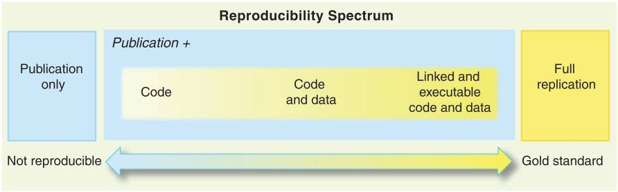

# Flujos y protocolos reproducibles

## Protocolos de estructura de carpetas reproducibles

Uno de los requisitos de la reproducibilidad es el orden de todos los documentos que componen un proyecto y que se encuentran interconectados entre sí. En un proyecto tenemos:

- datos
- datos procesados
- código de análisis
- manustritos
- presentaciones
- imágenes
- referencias

... entre otros. Ya que el orden de cada proyecto en general se basa en la lógica y costumbres personales, es muy difícil que alguien externo al proyecto pueda entender claramente cual es la racionalidad a la base del conjunto de archivos que componen un proyecto. Por tanto si se quiere reproducir un análisis, en general hay que contactar al investigador/a personalmente, pedirle que facilite los archivos y que expliqué que hizo y cómo lo hizo. Es decir, naturalmente no es una lógica reproducible.

Para permitir la reproducibilidad a veces se piensa que basta con compartir el código de análisis. Pero tal como refiere Peng(2011), este es un nivel muy bajo en el _espectro de reproducibilidad_.

(Peng, 2011)

Además del código por supuesto se requieren los datos, y en un nivel aún mejor el código y los datos vinculados para facilitar la labor de reproducibilidad. Para poder avanzar en esta dirección se han propuesto protocolos de trabajo que respeten ciertas bases mínimas de orden y lógica de archivos y carpetas. Uno de los principales es el proyecto [TIER](https://www.projecttier.org/), que propone una estructura de orden de archivos y carpetas que facilitan la reproducibilidad, y que está orientado a la enseñanza de pregrado.

La estructura se resume en el siguiente esquema:

